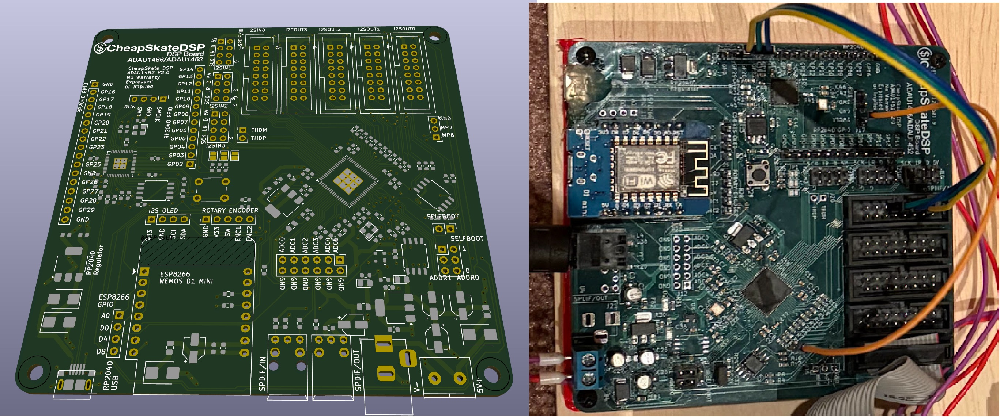
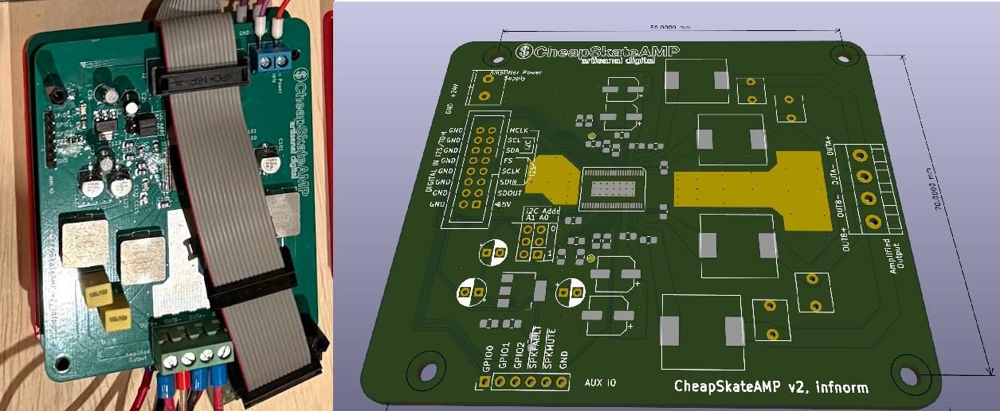
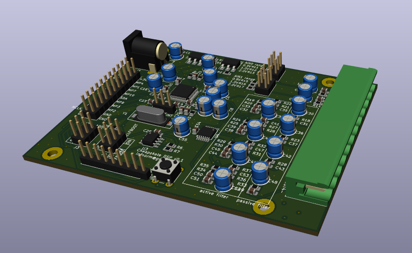
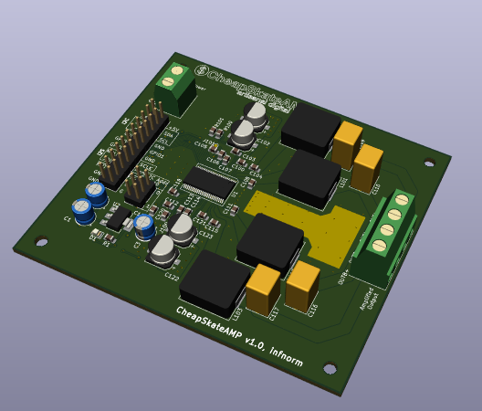
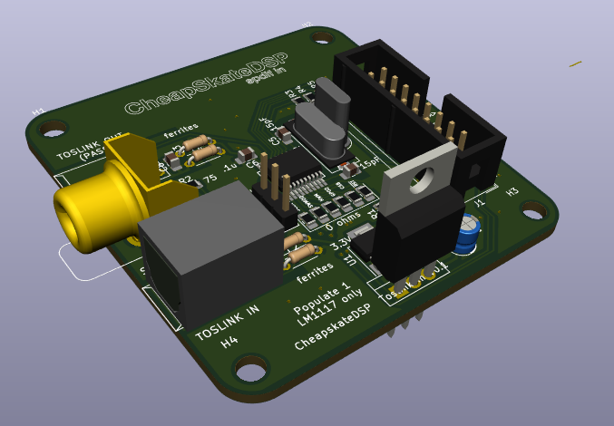

# CheapAudio

## Introduction

The purpose of this project is to create a set of hardware and software that allows you to do your own speakers that involve active crossovers.

Software is extremely rough, mostly used for my own purposes. Use at your own risk, what contributions are welcome. 

## Components

### Current hardware

#### CheapDSP V3 - ADAU1452 based DSP board w/ RP2040 USB sound card

#### CheapAMP V2 - AD TI TAS 5754M Amp Modified to have compatible connector w/ V3

### Older Hardware

#### CheapDSP - ADAU1701 based DSP board

#### CheapAMP - TI TAS 5754M Amp

#### CheapSPDIF - SPDIF to i2s supported by wolfsen chip

One thing that I've done uniquely with these is that I have used skidl to design the circuit using python script. This has the downside that there is no hardware schematic, only a PCB layout.

### Software
  * dspserver - A server that runs on a esp8266 that allows you to upload new firmwares for your DSP, control volume, etc. It also implements Sigma Studio TCP/IP interface so you can use the Sigma Studio tools w/o the USB interface
  * React - The start of an interface for manipulating the DSP through the web
  * Tools - Utility scripts to convert various SigmaStudio 
  * Measuring - NumPy script that can measure response curve from calibrated Microphone

## License

This project is licensed under Apache 2.0 for the softawre and CERN Open Hardware Licence Version 2 – Permissive for the hardware.

## Warranty

There is no warranty implied or otherwise (see license file for details).
This is not a ready to use and tested product. Use at your own risk.

